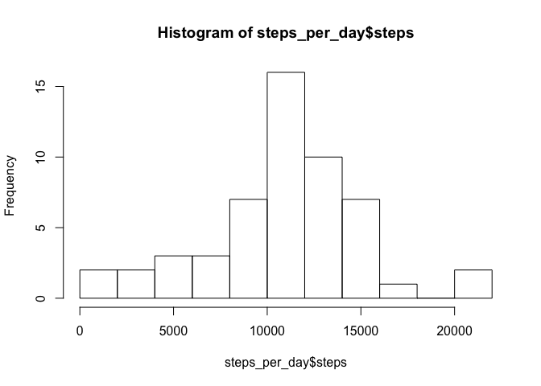
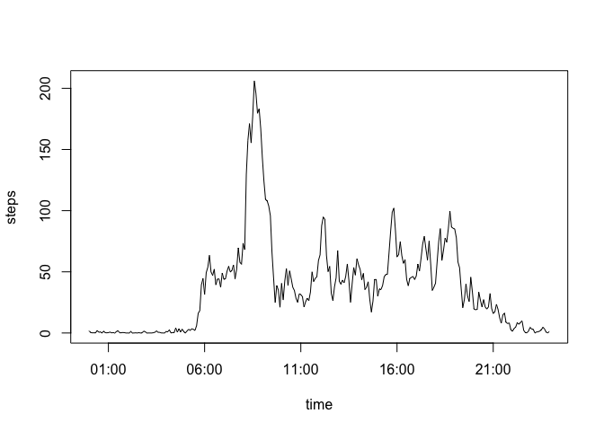
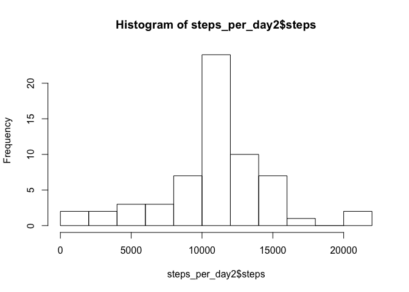

# Reproducible Research: Peer Assessment 1


## Loading and preprocessing the data

```r
library(dplyr)
```

```
## 
## Attaching package: 'dplyr'
## 
## The following objects are masked from 'package:stats':
## 
##     filter, lag
## 
## The following objects are masked from 'package:base':
## 
##     intersect, setdiff, setequal, union
```

```r
activity <- read.csv("activity.csv", stringsAsFactors = T)
```

## What is mean total number of steps taken per day?


### Calculate total number of steps taken per day

```r
steps_per_day <- 
    activity %>% 
    group_by(date) %>% 
    summarise_each(funs(sum), steps)
    
head(steps_per_day)
```

```
## Source: local data frame [6 x 2]
## 
##         date steps
##       (fctr) (int)
## 1 2012-10-01    NA
## 2 2012-10-02   126
## 3 2012-10-03 11352
## 4 2012-10-04 12116
## 5 2012-10-05 13294
## 6 2012-10-06 15420
```

### Histogram of the total number of steps taken each day

```r
hist(steps_per_day$steps, breaks = 10)
```

 

### Mean and median total number of steps taken per day

```r
sumvals <-
steps_per_day %>% 
    filter(!is.na(steps)) %>%
    summarise_each(funs(mean, median), steps)
```

Mean total per day: 

```r
sumvals[[1]] 
```

```
## [1] 10766.19
```

Median total per day: 

```r
sumvals[[2]] 
```

```
## [1] 10765
```


## What is the average daily activity pattern?

1. Make a time series plot (i.e. type = "l") of the 5-minute interval (x-axis) 
and the average number of steps taken, averaged across all days (y-axis)


Average over days

```r
avg_steps_per_interval <- 
    activity %>% 
    filter(!is.na(steps)) %>%
    group_by(interval) %>% 
    summarise_each(funs(mean), steps)

# Convert interval to date
avg_steps_per_interval <- 
    avg_steps_per_interval %>%
    mutate(hour =  sprintf("%02d", (interval %/% 100))  ,
              minute = sprintf("%02d", (interval %% 100))  ,
              timeStr = paste(hour, minute, sep = ":"))
    
avg_steps_per_interval$time <-          
    strptime(avg_steps_per_interval$timeStr, format = "%H:%M")

# Plot
with(avg_steps_per_interval,
    plot(time, steps, pch = "", type = "l"))
```

 

2. Which 5-minute interval, on average across all the days in the dataset, 
contains the maximum number of steps?

Time interval containg Maximum daily steps in hh:mm format:


```r
avg_steps_per_interval[avg_steps_per_interval$steps == max(avg_steps_per_interval$steps), 5][[1]]
```

```
## [1] "08:35"
```

## Imputing missing values

1. Calculate and report the total number of missing values in the dataset 
(i.e. the total number of rows with NAs)


```r
#Total number of rows with missing values:
sum(is.na(activity$steps))
```

```
## [1] 2304
```

2. Devise a strategy for filling in all of the missing values in the dataset.
The strategy does not need to be sophisticated. For example, you could use the
mean/median for that day, or the mean for that 5-minute interval, etc


```r
# convert interval to factor
activity$interval2 <- as.factor(activity$interval)
avg_steps_per_interval$interval2 <- as.factor(avg_steps_per_interval$interval)

#merge on interval with daily average
activity <- merge(x = activity, y = avg_steps_per_interval, by.x = "interval2", by.y = "interval2")

# impute NA steps
activity <- activity %>%
    mutate(impute_steps = ifelse(is.na(activity$steps.x),activity$steps.y,activity$steps.x))

str(activity)
```

```
## 'data.frame':	17568 obs. of  11 variables:
##  $ interval2   : Factor w/ 288 levels "0","5","10","15",..: 1 1 1 1 1 1 1 1 1 1 ...
##  $ steps.x     : int  NA 0 0 0 0 0 0 0 0 0 ...
##  $ date        : Factor w/ 61 levels "2012-10-01","2012-10-02",..: 1 54 28 37 55 46 20 47 38 56 ...
##  $ interval.x  : int  0 0 0 0 0 0 0 0 0 0 ...
##  $ interval.y  : int  0 0 0 0 0 0 0 0 0 0 ...
##  $ steps.y     : num  1.72 1.72 1.72 1.72 1.72 ...
##  $ hour        : chr  "00" "00" "00" "00" ...
##  $ minute      : chr  "00" "00" "00" "00" ...
##  $ timeStr     : chr  "00:00" "00:00" "00:00" "00:00" ...
##  $ time        : POSIXlt, format: "2015-12-20 00:00:00" "2015-12-20 00:00:00" ...
##  $ impute_steps: num  1.72 0 0 0 0 ...
```


3. Create a new dataset that is equal to the original dataset but with the 
missing data filled in.


```r
activity2 <- activity[,c("impute_steps","date","interval.x")]
activity2$steps <- activity2$impute_steps 
activity2$impute_steps <- NULL
activity2$interval <- activity2$interval.x 
activity2$interval.x <- NULL

activity2 <-
 activity2 %>% arrange(date, interval)
```

4. Make a histogram of the total number of steps taken each day and Calculate
and report the mean and median total number of steps taken per day. Do these 
values differ from the estimates from the first part of the assignment? What 
is the impact of imputing missing data on the estimates of the total daily 
number of steps?


```r
steps_per_day2 <- 
    activity2 %>% 
    group_by(date) %>% 
    summarise_each(funs(sum), steps)
head(steps_per_day2)
```

```
## Source: local data frame [6 x 2]
## 
##         date    steps
##       (fctr)    (dbl)
## 1 2012-10-01 10766.19
## 2 2012-10-02   126.00
## 3 2012-10-03 11352.00
## 4 2012-10-04 12116.00
## 5 2012-10-05 13294.00
## 6 2012-10-06 15420.00
```

```r
# 2. Make a histogram of the total number of steps taken each day
hist(steps_per_day2$steps, breaks = 10)
```

 

```r
summary <-
    steps_per_day2 %>% 
    filter(!is.na(steps)) %>%
    summarise_each(funs(mean, median), steps)
```


Mean and median of imputed data:


```r
summary
```

```
## Source: local data frame [1 x 2]
## 
##       mean   median
##      (dbl)    (dbl)
## 1 10766.19 10766.19
```

## Are there differences in activity patterns between weekdays and weekends?

